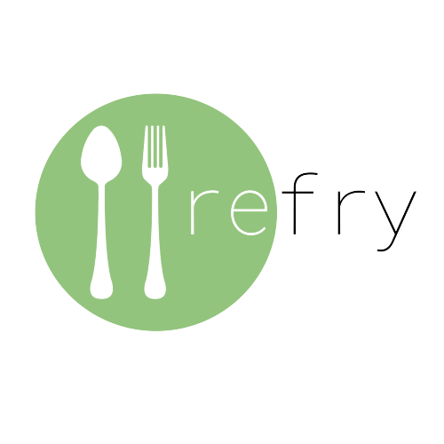
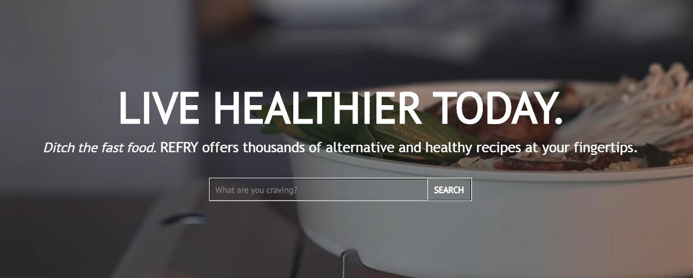
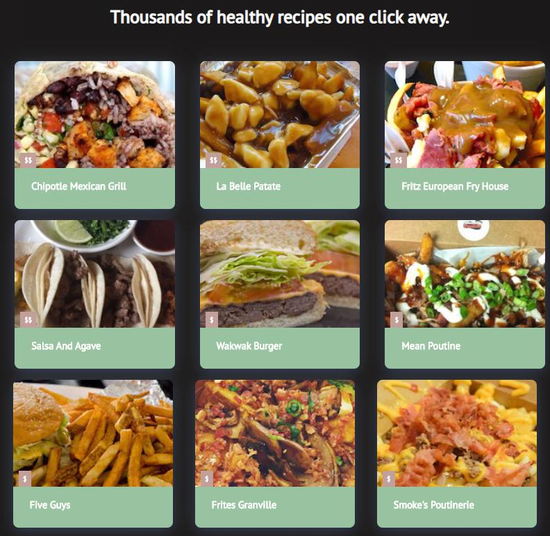
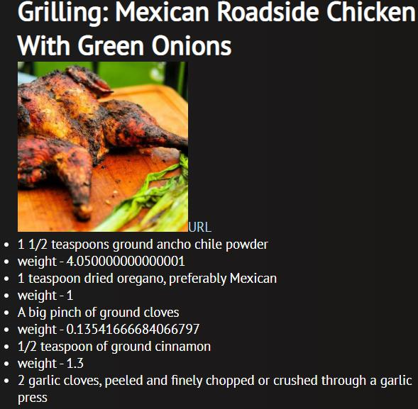

 <div align="center"></div>
 
 # <div align="center">Ditch the fast food</div>


View the website @ [https://refry-hack-davis.herokuapp.com/](https://refry-hack-davis.herokuapp.com/ "Refry")

# Table of Content:
- [Watch on YouTube](#watch-our-video)
- [Display Shots](#display-shots)
- [Programming Language used ](#programming-language-used)
- [Key Features](#key-features)
- [Contact info](#contact-info)
- [Member List and github repo](#member-list-and-github-repos)

## Watch our video
[](https://www.youtube.com/watch?v=VVLTVvItczg&feature=youtu.be "Watch our Pitch on YouTube")

## Display shots

<div align="center"></div>  
<div align="center"></div>  
<div align="center"></div>  

# Programming language used

This project was build using React JS with the JSX language, Javascript, HTML5, and CSS3.

# Key Features
- Used node JS, React JS, and many of its features such as Hooks, Redux, Components, and functional/OOP concepts.
- Simplicity in instructions to allow the user to quickly and easily find the recipes or restaurants they need
- Beautiful UI designed on Figma that pleases the player and dark theme which is easy on the eyes.
- Read about the impact you can make to yourself and the world through using our app in pursuit of a sustainable lifestyle
- Uses Zomato and Edamam's APIs to show nearby restaurants and delicious recipes

# Future Scope 
- Refining existing functionalities to incorporate more restaurants, recipes, and better images
- Fine tune our UI to render information fetched from the APIs in an even more aesthetic fashion
- Incorporate a map or location feature to allow users to find restaurants nearby their own location


 
 # Contact info 
 
 ```
 [mailto](davissong01@gmail.com)
 ```
 ```
 kennyjiahuacheng@gmail.com
 ```
 ```
 alicekanng@gmail.com
 ```
 ```
 wjvanss@gmail.com
 ```

 
 # Member list and Github repos
 - Kenny : https://github.com/kennyjhcheng
 - Alice : https://github.com/alicekanng
 - Davis : https://github.com/d-x-s
 - Vanessa : https://github.com/jvxx

 

